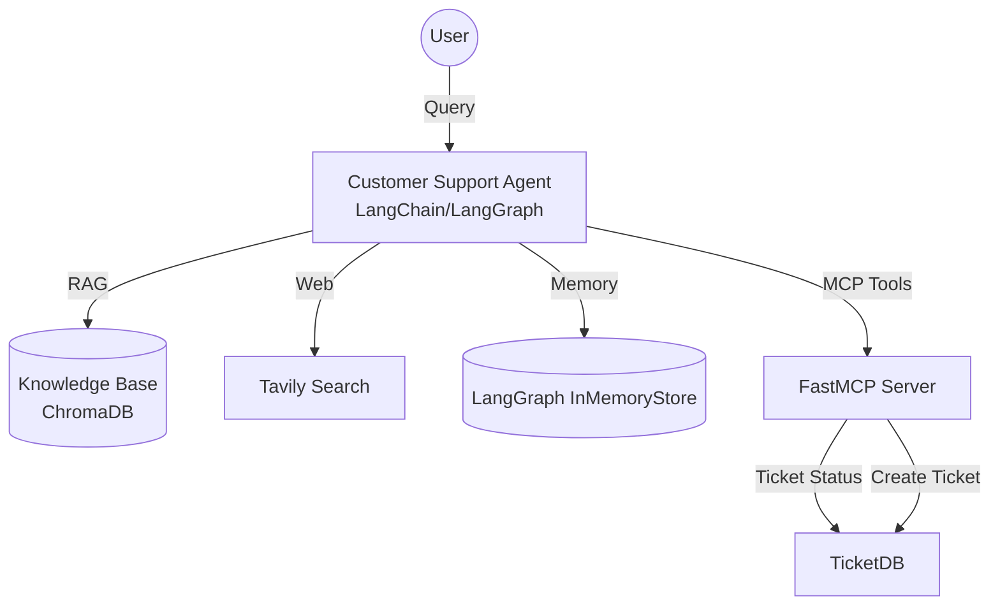

# Confident AI Demo: Customer Support Agent

Welcome to the **Customer Support Agent** demonstration repository. This project showcases a robust, production-ready AI agent built using **LangChain** and **LangGraph**, comprehensively evaluated using **DeepEval** and red-teamed using **DeepTeam**.

---

## 🎯 Overview

The **Customer Support Agent** (formerly the Research Agent) is an autonomous, tool-calling assistant designed to answer user queries, manage support tickets, and maintain long-term context about customers. It utilizes a central OpenRouter LLM acting as the reasoning engine and orchestrates multiple advanced tools to resolve complex, multi-turn interactions.

## 🏗️ Architecture



### Core Components

1. **The Agent (`research-agent/agent.py`)**
   - The central reasoning engine utilizing a dual-layer guardrail system (`guardrail.py`) to prevent prompt injections and off-topic conversations.
   - Maintains conversational state and long-term memory via LangGraph.

2. **Tools & Capabilities**
   - **Internal RAG (`search_knowledge_base`)**: Vector search over Chroma DB using BGE-M3 embeddings.
   - **Web Search (`search_web`)**: Tavily integration for fetching public internet data.
   - **Long-Term Memory (`remember_fact` / `recall_facts`)**: Saves user preferences and facts across sessions.
   - **MCP Server (`mcp_server.py`)**: Uses Model Context Protocol (MCP) to provide mock tools for checking and creating support tickets.

## 📁 Repository Structure

* **`research-agent/`**: Contains the core LangChain/LangGraph application, guardrails, MCP server, and RAG ingestion scripts.
* **`Data-Generation/`**: Scripts utilizing DeepEval's `Synthesizer` and `ConversationSimulator` to generate synthetic single-turn and multi-turn evaluation datasets.
* **`Evaluation/`**: A comprehensive DeepEval testing suite covering:
  * Trace-based agent metrics (Step Efficiency, Task Completion).
  * Strict gating using JevEval for deterministic tool-call analysis.
  * Multi-turn conversational flow evaluation.
  * Standard RAG metrics (Faithfulness, Answer Relevancy, Precision).
* **`RedTeaming/`**: Automated adversarial red teaming using `deepteam` to expose vulnerabilities like Goal Theft, PII Leakage, Toxicity, and System Override.

## 🚀 Getting Started

### Prerequisites

You will need Python 3.10+ and the following API keys configured in a `.env` file in the root directory:
```env
OPENROUTER_API_KEY=your_openrouter_api_key
TAVILY_API_KEY=your_tavily_api_key
CONFIDENTAI_API_KEY=your_deepeval_api_key
```

### Installation

Install the required dependencies:
```bash
pip install -r requirements.txt
```

### Running the Agent

1. Ingest the documents into the local Chroma vector database:
```bash
cd research-agent
python ingest.py
```

2. Start the interactive agent session:
```bash
python agent.py
```

Try asking it complex, multi-part questions to test its memory, RAG, and MCP tool capabilities simultaneously!
